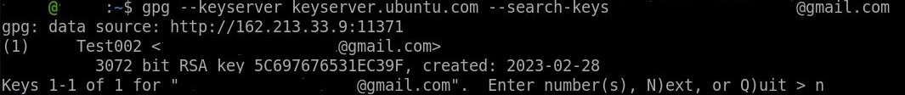

# InfoSec_h5

## x) Read and summarize (Some bullets per article is enough for summary) € Schneier 2015: Applied Cryptography: 10. Using Algorigthms: 10.1, 10.2, 10.3, 10.4 (from start until the start of "Dereferencing Keys" in 10.4)

### 10.1 Choosing an Algorithm

* When it comes to evaluating and choosing encryption algorithms, there are several options, including choosing a published algorithm, trusting a manufacturer or private consultant, trusting the government, or writing your own algorithm.
* Creating your own algorithm can be a solution, but it could leave room for security flaws as it has not been tested by other experts in the field.
* Trusting a single entity is problematic, so choosing a published algorithm is the most sensible option.
* It is believed that algorithms approved for export by the U.S. government can be broken by the NSA, and they may even suggest deliberate weaknesses to companies wishing to export their products.
* Relying on a company's reputation or hiring a security consultant is not a guarantee of security, since they may have limited or no knowledge of cryptography.
* To prove that the NSA can break an algorithm, it is necessary to encrypt information of great importance that is worth demonstrating that the NSA can break it.
* It is assumed that the NSA can read any message it chooses, but due to limited resources, it cannot read all messages it wants.

#### Algorithms for Export:

* Algorithms for export out of the United States must be approved by the U.S. government.
* It is widely believed that these export-approved algorithms can be broken by the NSA.
* The NSA possesses the source code for all government-approved algorithms for export.

### 10.2 Public-Key Cryptography versus Symmetric Cryptography

* The comparison of public-key cryptography and symmetric cryptography is irrelevant because they serve different purposes.
* Needham and Schroeder argued that symmetric algorithms are more efficient than public-key algorithms. However, this overlooks the security benefits of public-key cryptography.
* Whitfield Diffie suggested the adoption of a combination of systems, where public-key systems are only used for exchanging keys for symmetric cryptography.
* Symmetric cryptography is faster and better for encrypting data 
while public-key cryptography is better for key management and protocols.

### 10.3 Encrypting Communications Channels

* Encryption can take place at any layer in the OSI communications model.
* Link-by-link encryption is done at the lowest layers, and end-to-end encryption is done at higher layers.
* Link-by-link encryption encrypts everything going through a particular data link.
* End-to-end encryption selectively encrypts data until they are decrypted by the intended final recipient.

#### Link-by-Link Encryption:

* Link-by-link encryption is very effective, as it will encrypt all data, including the routing information and protocol information.
* This type of encryption is also called traffic-flow security since it implemented in the physical layer of the network.
* Security does not depend on any traffic management techniques. Thats why the key management is simple since only the two endpoints of the line need a common key
* The biggest problem with encryption at the physical layer is that each physical link in the network needs to be encrypted
* If the network is large, the cost may quickly become extremely high for this kind of encryption, because every node in the network must be protected
* Table 10.1 shows the process of link-by-link encryption

#### End-to-End Encryption:

* Encryption and decryption at the physical layer is avoided by end-to-end encryption.
* This Approach put encryption equipment between the network layer and the transport layer
* End-to-end encryption keeps data encrypted until it reaches its final destination.
* Routing information for data is not encrypted in end-to-end encryption, which can lead to traffic analysis.
* Building end-to-end encryption approach is difficult because each particular communications system has its own protocols
* Encryption at high layers interacts with user software and may have compatibility problems with different computer types.
* Table 10.2 shows the process of end-to-end encryption

#### Combining the Two:

* Combining both methods is the most effective way of securing a network
* Encryption of each physical link makes routing information analysis impossible
* End-to-end encryption reduces the threat of unencrypted data at the various nodes in the network
* Key management for both approches can be completely separate
* Network managers can take care of physical-level encryption, while users have responsibility for end-to-end encryption
* This approach is the costliest because it requires the implementation of both encryption methods.

### 10.4 Encrypting Data for Storage 

* Encryption for data storage is different from encryption for communication channels.
* Data encrypted for storage cannot be resent like messages in transit, and may be lost forever if decryption fails.
* Encryption applications for data storage should have mechanisms to prevent unrecoverable errors in ciphertext.
* Keys used for data storage will be around for a long time, so key management and safety for long-term is crucial.
* End-to-end encryption has higher secrecy level but requires a more complex key-management system and encryption in offline mode.

Encrypting computer data for storage comes with various challenges such as the possibility of known-plaintext attacks, ciphertext being larger than plaintext, the need for fast encryption and decryption, and complex key management for different files and people.

## y) Choose a password manager and explain: 

In this section, I have looked at two different password managers. The 1. an offline password manager KeePass and 2. an online password manager LastPass.

### What treaths does it protect against?

1. KeePass protects against various threats including password theft, phishing, keylogging, and dictionary attacks. It stores all passwords in an encrypted database, making it more difficult for hackers to access them.

2. LastPass password manager protects against various cybersecurity threats, such as phishing, password reuse, weak passwords, and brute-force attacks.

### What information is encrypted, what's not?

1. KeePass encrypts all the information stored in its database, including usernames, passwords, and any other notes or comments associated with the passwords. However, it does not encrypt the file names or the database structure.

2. in LastPass all sensitive information, including usernames, passwords, and credit card details, is encrypted using AES-256 encryption with PBKDF2 SHA-256 and salted hashes. LastPass encrypts the data locally before sending it to the server, and only the user can decrypt the data using their master password. Non-sensitive data, such as website URLs, is not encrypted.

### What's the license? How would you describe license's effects or categorize it?

1. KeePass is an open-source software released under the GNU General Public License. The license grants users the freedom to run, copy, distribute, study, change, and improve the software. The software is free to use, and users are not required to pay any fees or purchase a license to use it.

2. LastPass offers both free and premium versions of its password manager. The free version has basic features, while the premium version provides advanced features like multifactor authentication, priority tech support, and more. The license for the premium version is subscription-based, and the user needs to pay a yearly fee to access the premium features.

### Where is the data stored? If in "the cloud", which country / juristiction / which companies? If on local disk, where?

1. KeePass is an offline password manager, which means that all data is stored locally on the user's computer or device. Users have complete control over their data and do not need to rely on any third-party cloud service or company to store their passwords.

2. LastPass stores user data on its servers, which are located in the United States and Europe. The company claims that it uses Amazon Web Services (AWS) to host its servers, and the data is stored in multiple locations to ensure redundancy and reliability.

### How is the data protected?

1. KeePass encrypts all data using the Advanced Encryption Standard (AES) algorithm, which is a widely accepted and secure encryption standard. The user's master password is used as the encryption key, and only the user has access to it. KeePass also offers additional security features such as two-factor authentication and the ability to lock the database after a certain period of inactivity.

2. LastPass protects user data using various security measures, including AES-256 encryption, multifactor authentication, and SSL/TLS encryption for data transfer. The company also undergoes regular security audits and penetration testing to ensure the highest level of security. Additionally, LastPass provides users with tools to generate strong passwords and check for password duplicates to minimize the risk of data breaches.

## a) Demonstrate the use of a password manager.

1. To use KeePass on Linux, we need to first install it. To install the KeePass, lets Open a terminal and run the following command:
       
       $ sudo apt-get update && sudo apt-get upgrade -y
       $ sudo apt-get install keepass2
      
2. Next we can Launch KeePass. We can launch KeePass by searching for it in the applications menu or running the command in the terminal.

       $ keepass2
      
3. Next we need to create a new database. To create a new password database, lets go to File > New or use the keyboard shortcut Ctrl+N. Choose a location and filename for the database, then set a strong master password.

4. Then we have to add new password entry. We can right-click on the database and select Add Entry. Fill in the username, password, and any other relevant information.

5. After adding all your password entries, save the database and close KeePass. Your passwords are now securely stored and can be accessed anytime by opening the database with KeePass and entering the master password.

## b) Encrypt and decrypt a message:

GPG (GNU Privacy Guard) is a popular open-source encryption tool that allows users to encrypt and decrypt messages and files.

1. To encrypt a message with GPG, we have to install it. Lets open a terminal and run the following command:
      
        $ sudo apt-get install gnupg
       
2. Next we can generate a key pair. To use GPG, we will need to generate a public and private key pairs. We can do it by running the following command in a terminal.

        $ gpg --gen-key   
        
We can displaying the public keys stored in the keyring
       
        $ gpg --list-keys
 
displaying the secret keys stored in the keyring
       
        $ gpg --list-secret-keys
        $ gpg --list-secret-keys --keyid-format short
        $ gpg --list-secret-keys --keyid-format long     
        

        
3. Then we can encrypt a message. To encrypt a message, we can use the following command:

        $ gpg --encrypt --recipient name@example.com message.txt
        

4. To decrypt a message we can use the following command:

        $ gpg --decrypt message.txt.gpg > message.txt

## c) Voluntary bonus: send and receive encrypted message over email.

## e) Voluntary bonus, easy: try rot13, the military grade top-secret encryption of the top-2 empire of year zero. Could double rot13 provide extra security?

The rot13 encryption is a simple Caesar cipher that replaces each letter with the letter 13 positions down the alphabet. On Linux we can try it, using "tr" command.

At first, lets open the terminal. Then we can type the following command to encrypt text:

       $ echo "Hello" | tr 'a-zA-Z' 'n-za-mN-ZA-M'
      

To decrypt the text, we can simply repeat the process:

       $ echo "Uryyb Greb" | tr 'n-za-mN-ZA-M' 'a-zA-Z'
      
      
The rot13  is not a secure encryption method and should not be used to protect sensitive information. Doubling the rot13 encryption would provide no additional security.

## References:
*
